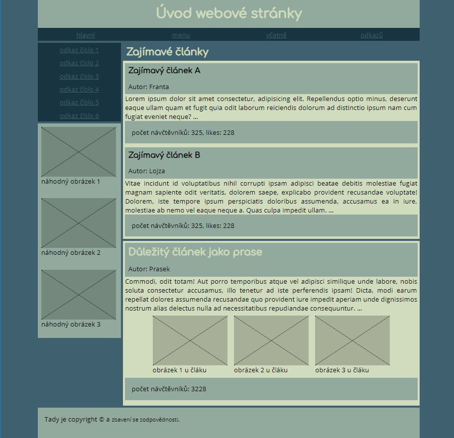

# Sémantika webové stránky

Napište pomocí čistého HTML5 strukturu stránky, tak aby používala správné označení bloků dle jejich významu. Pro lepší názornost se pokuste blokové prvky tvořící strukturu dokumentu doplnit o nadpisy a odstavce textu.  Obrázky nevkládejte, namísto nich použijte prázdný tag 
.

Stránka vypadá takto – každý obdélník představuje blokový prvek:

Pokud se vše podaří, bude výsledek vypadat takto:

Nezapomeňte stránku zkontrolovat validátorem.